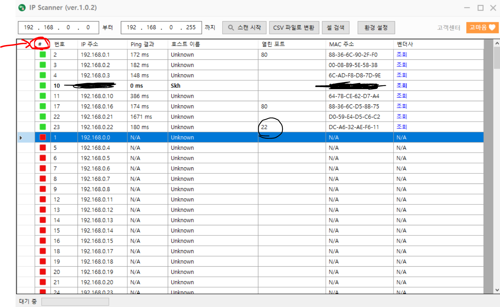
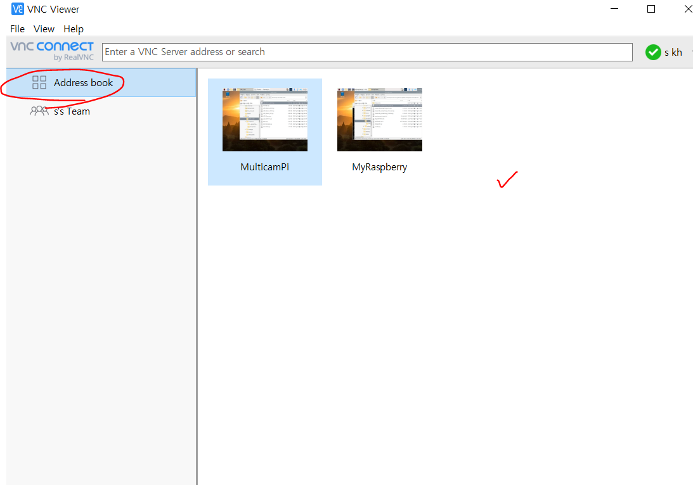
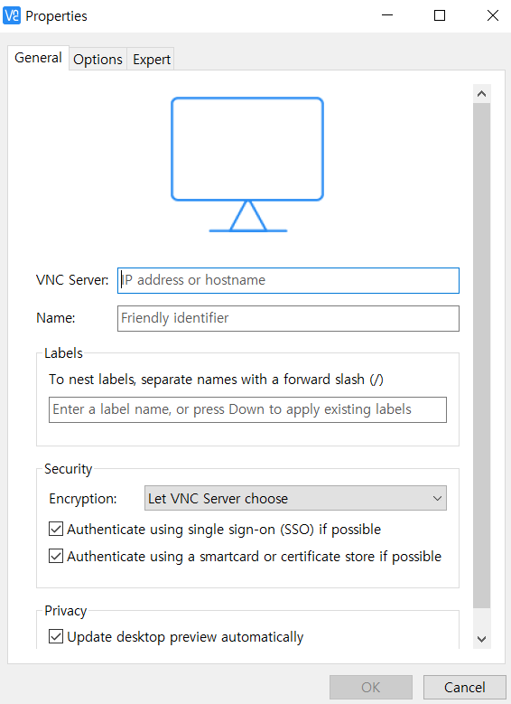
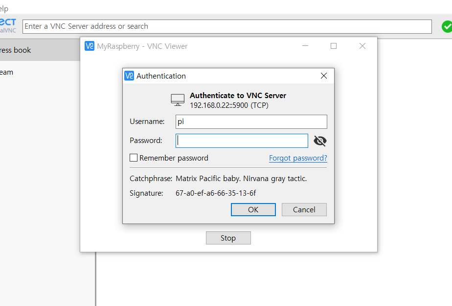

# project_helper_IoT 사용법

## Raspberry Pi

강의장에서 Wifi 설정하기

https://blog.naver.com/heaves1/222296065215

> 1. SD카드 리더기에 Pi sd카드 넣고 (팝업으로 포멧하라고 하는데 **무시!**)
> 2. 메모장 하나 만들기(이름은 아무거나 임시로) 
> 3. 내용을 
>
> country=US  
>
> ctrl_interface=DIR=/var/run/wpa_supplicant GROUP=netdev  
>
> update_config=1  
>
> network={  ssid="WIFI 이름"  psk="WIFI 비밀번호"  scan_ssid=1  } 
>
> 4. 강의장에 해당하는 Wifi 이름과 비밀번호 넣기.
> 5. 파일 이름과 확장자를 wpa_supplicant.conf  로 바꾸기
> 6. https://www.zzaturi.com/ip_scanner ip scanner 다운받아서 라즈베리파이에 할당된 ip 확인 ! (다른 사람것만 잡히고 내꺼가 안잡히면 잡힐때 까지 파이 전원선을 뺐다가 꼽아 재부팅. 다른 사람 ip라고 판단되면 메모해서 기억해두기)

7.  #버튼 누르면 초록색으로 새로운 ip들 확인 가능. 포트번호가 할당된것 우선 확인하기.

8. vnc 설치 https://www.realvnc.com/en/connect/download/viewer/

9. 

   address book에서 마우스 오른쪽 클릭 New Connection

10. ip scanner로 찾은 라즈베리 파이 ip를 VNC Server에 넣고 Name은 아무거나
11. 성공하면 

비번 1228. (다른 사람들 라즈베리파이도 이름이 거의 다 pi라서 접속 안되면 다른 사람 기기임)

