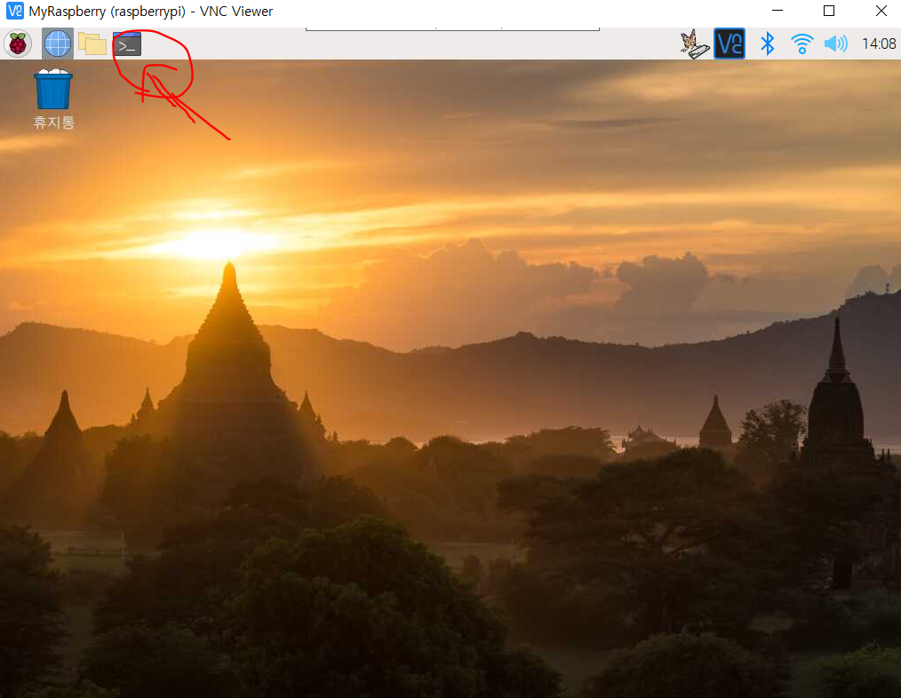

# STT 실행법

1. ~~cmd창 2개 열기~~
2.  ~~source env/bin/activate 로 가상환경 실행(cmd 둘 다). 성공하면 코드 앞에 (env)라고 뜸~~
3. ~~두 cmd다 cd iot/mic/python-speech/samples/microphone 입력~~
4. ~~한 cmd에선 python3 MyMqtt (송수신용 먼저 키기)~~
5. ~~나머지 cmd에선 export GOOGLE_APPLICATION_CREDENTIALS="/home/pi/Downloads/my-stt-test-313404-86d2222c782c.json"~~ 
6. ~~export한 cmd에서 python3 transcribe_streaming_mic33.py 실행 (음성 인식 스레드 부분)~~

* 자동화 완료. 부팅하면 자동 실행됩니다. ( sudo nano /home/pi/.bashrc 와 sudo nano /etc/xdg/lxsession/LXDE-pi/autostart 이용)

* STT_Test.py는 pc의 pycharm에서 MQTT 수신 - 출력 테스트를 해보기 위한 파일